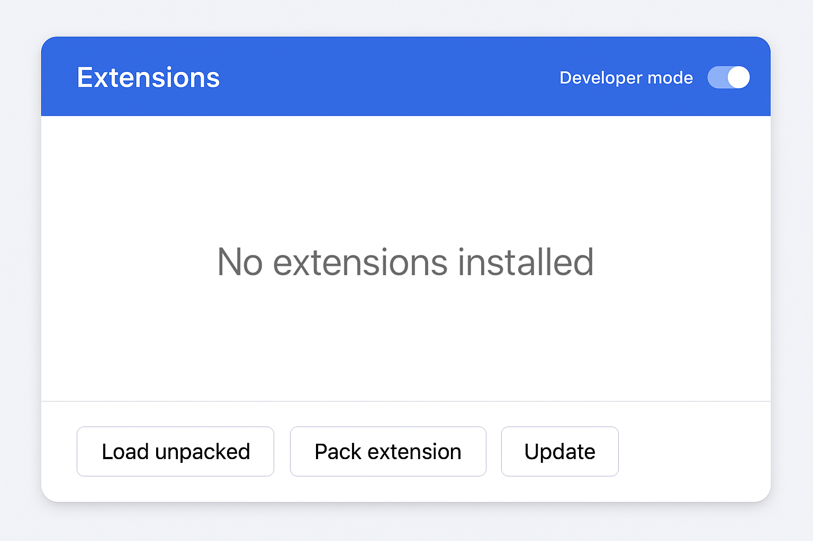
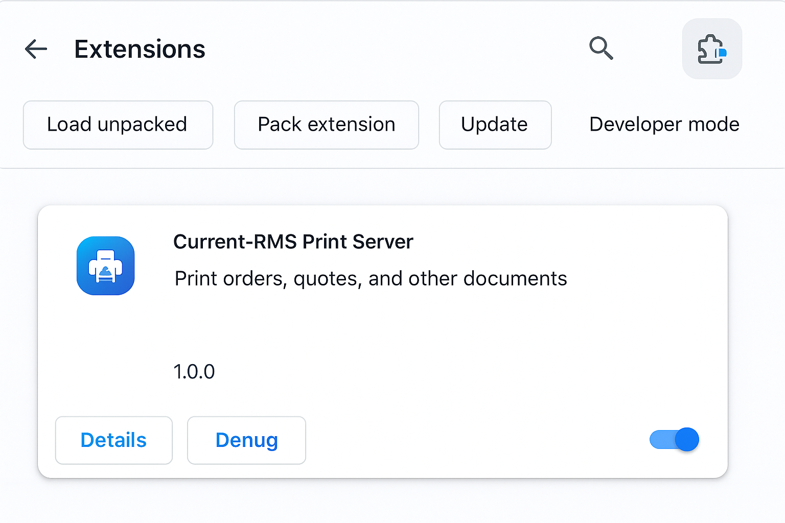
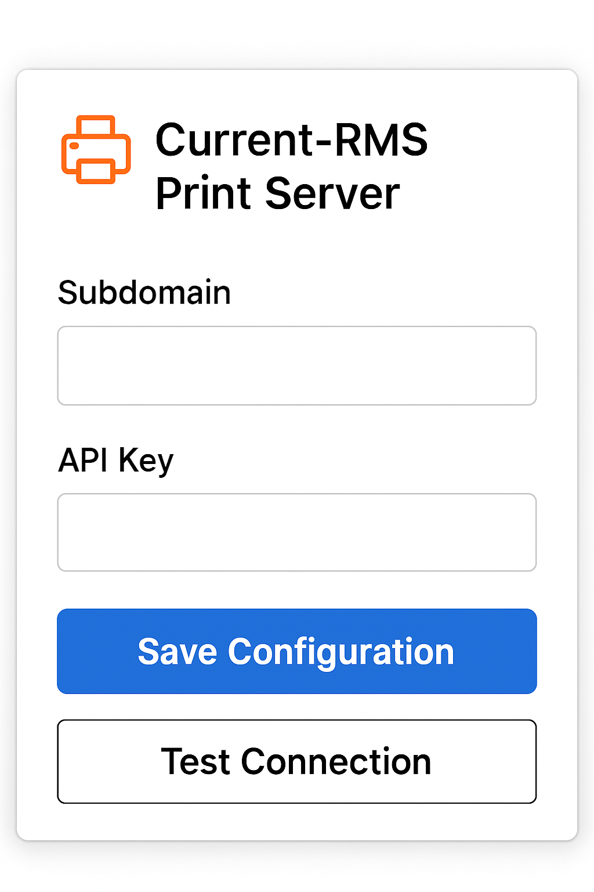
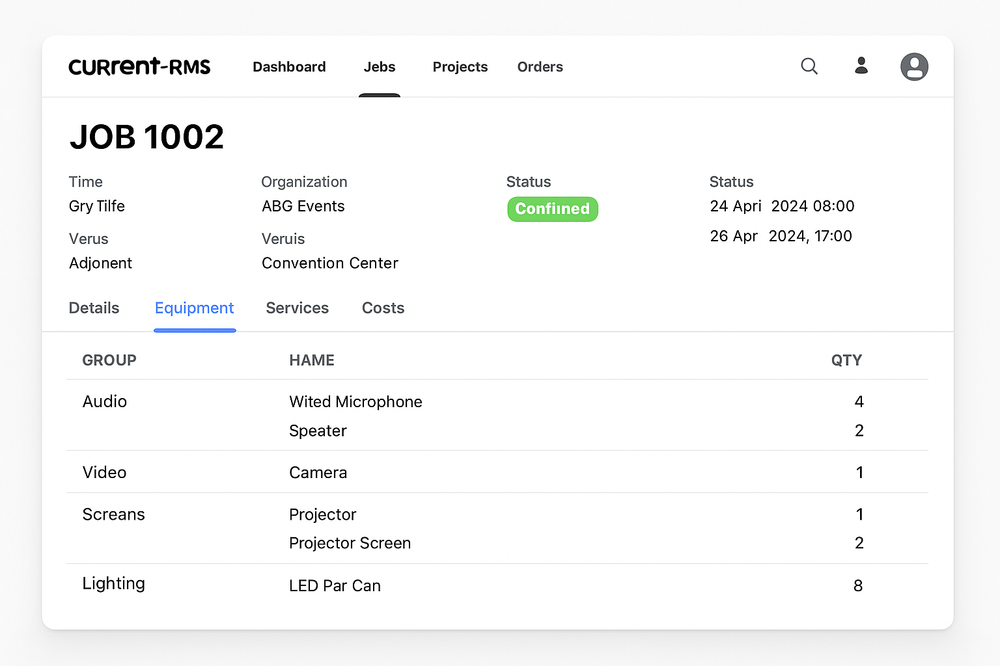

# Current-RMS Print Server Extension - Complete Demonstration Guide

**Author:** Manus AI  
**Date:** September 1, 2025  
**Version:** 1.0.0

## Table of Contents

1. [Introduction](#introduction)
2. [Prerequisites](#prerequisites)
3. [Installation Process](#installation-process)
4. [Initial Configuration](#initial-configuration)
5. [Basic Usage Workflow](#basic-usage-workflow)
6. [Advanced Features](#advanced-features)
7. [Troubleshooting Common Issues](#troubleshooting-common-issues)
8. [Performance Optimization](#performance-optimization)
9. [Security Considerations](#security-considerations)
10. [Future Development](#future-development)

## Introduction

The Current-RMS Print Server Extension represents a sophisticated solution designed to streamline the process of printing individual flightcase labels from Current-RMS job management systems. This comprehensive demonstration guide provides detailed, step-by-step instructions accompanied by visual documentation to ensure users can effectively implement and utilize this powerful tool in their operational workflows.

The extension addresses a critical pain point in event management and equipment rental operations where traditional PDF printing methods require users to print entire documents containing multiple labels, leading to waste, inefficiency, and increased operational costs. By implementing intelligent barcode scanning and selective printing capabilities, this extension transforms the label printing process into a precise, efficient operation that saves both time and resources.

This demonstration guide has been meticulously crafted to provide users with a complete understanding of the extension's capabilities, from initial installation through advanced usage scenarios. Each section builds upon previous knowledge while providing practical examples and real-world applications that demonstrate the extension's value in professional environments.

The technical architecture underlying this extension leverages modern web technologies including Chrome's Extension API, secure local storage mechanisms, and advanced PDF processing capabilities. The user interface has been designed with accessibility and efficiency in mind, ensuring that both technical and non-technical users can quickly master the system's functionality.

Throughout this guide, we will explore not only the mechanical aspects of using the extension but also the strategic considerations that make it an essential tool for organizations managing complex equipment inventories and rental operations. The integration with Current-RMS systems ensures seamless workflow continuity while the barcode scanning capabilities provide the precision required for accurate equipment tracking and management.

## Prerequisites

Before beginning the installation and configuration process, users must ensure their systems meet specific technical requirements and have access to necessary credentials and resources. The extension has been developed specifically for Google Chrome and requires certain permissions and capabilities to function correctly.

**System Requirements**

The extension requires Google Chrome version 88 or later, though we recommend using the most recent stable version to ensure optimal performance and security. The system must have sufficient memory to handle PDF processing operations, with a minimum of 4GB RAM recommended for smooth operation when processing large flightcase label documents. Users should also ensure they have administrative privileges on their workstation to install extensions in developer mode.

**Current-RMS Access Requirements**

Users must possess valid Current-RMS account credentials with appropriate API access permissions. This includes having an active subdomain on the Current-RMS platform and a valid API key with read permissions for job and opportunity data. The API key must have sufficient privileges to access document downloads and job information, as these capabilities are essential for the extension's core functionality.

**Network and Security Considerations**

The extension requires internet connectivity to communicate with Current-RMS servers and download PDF documents. Organizations with restrictive firewall policies should ensure that connections to Current-RMS domains are permitted. Additionally, users should verify that their browser security settings allow for extension installation and operation, as some corporate security policies may restrict these capabilities.

**Hardware Requirements for Barcode Scanning**

While the extension supports manual barcode entry, optimal efficiency is achieved when used with dedicated barcode scanning hardware. USB barcode scanners configured to operate in keyboard emulation mode work seamlessly with the extension, providing rapid data entry capabilities that significantly enhance operational efficiency. Users should ensure their barcode scanners are properly configured and tested before implementing the extension in production environments.

## Installation Process

Installing the Current-RMS Print Server Extension requires loading it in developer mode within Google Chrome. This process is straightforward and allows for immediate testing and usage without requiring submission to the Chrome Web Store.

### Step 1: Enable Developer Mode

The first step is to enable developer mode in your Chrome browser. This setting provides access to advanced extension management features, including the ability to load unpacked extensions.

1.  **Navigate to the Extensions Page**: Open a new tab in Chrome and enter `chrome://extensions/` in the address bar.
2.  **Toggle Developer Mode**: Locate the "Developer mode" toggle in the top-right corner of the page and click it to enable this feature.

**Screenshot 1: Enabling Developer Mode**

### Step 2: Load the Unpacked Extension

Once developer mode is enabled, you can load the extension from your local file system. This involves selecting the folder containing the extension's source code.

1.  **Click "Load unpacked"**: With developer mode enabled, a new set of buttons will appear. Click the "Load unpacked" button.
2.  **Select the Extension Folder**: In the file selection dialog, navigate to the location where you extracted the `current-rms-print-server-extension` folder and select it.

**Screenshot 2: Loading the Unpacked Extension**

### Step 3: Verify Installation

After loading the extension, it will appear in your list of installed extensions. You can verify its installation and pin it to your toolbar for easy access.

1.  **Confirm Installation**: The Current-RMS Print Server Extension should now be visible in your extensions list.
2.  **Pin the Extension**: Click the puzzle piece icon in your Chrome toolbar to open the extensions menu. Find the "Current-RMS Print Server" extension and click the pin icon next to it. This will ensure the extension's icon is always visible in your toolbar.

**Screenshot 3: Verifying Installation and Pinning**

## Initial Configuration

After successfully installing the Current-RMS Print Server Extension, the next crucial step is to configure its connection to your Current-RMS account. This involves providing your subdomain and API key, which are essential for the extension to communicate with the Current-RMS API and retrieve necessary data.

### Step 1: Open the Extension Popup

To begin the configuration, click on the Current-RMS Print Server extension icon in your Chrome toolbar. This will open the extension's popup interface, which serves as the primary control panel for the extension.

**Screenshot 4: Opening the Extension Popup**

### Step 2: Enter Your Credentials

Within the extension popup, you will find two input fields: one for your Current-RMS subdomain and another for your API key. It is imperative to enter these details accurately to ensure a successful connection.

1.  **Subdomain**: Enter your Current-RMS subdomain. This is the first part of your Current-RMS URL, before `.current-rms.com`. For example, if your Current-RMS URL is `mycompany.current-rms.com`, you should enter `mycompany` into the subdomain field.
2.  **API Key**: Enter your Current-RMS API key. This key is a unique identifier that authenticates your requests to the Current-RMS API. You can typically find or generate your API key within your Current-RMS account settings, usually under a section like "API" or "Integrations."

**Screenshot 5: Entering Subdomain and API Key**

### Step 3: Save Configuration

Once you have entered both your subdomain and API key, click the "Save Configuration" button. The extension will securely store these credentials locally on your device using Chrome's `chrome.storage.local` API. This ensures that your sensitive information is not exposed and persists across browser sessions.

**Screenshot 6: Saving Configuration**

### Step 4: Test Connection

After saving your configuration, it is highly recommended to test the connection to your Current-RMS account. This step verifies that the provided credentials are correct and that the extension can successfully communicate with the Current-RMS API.

Click the "Test Connection" button. The extension will attempt to make a simple API request to Current-RMS using your saved credentials. A success message will be displayed if the connection is established, or an error message will indicate any issues, such as incorrect credentials or network problems.

**Screenshot 7: Testing Connection (Success)**

**Screenshot 8: Testing Connection (Failure)**

Upon successful configuration, the extension is ready for use. The next section will detail the basic workflow for utilizing the extension to print flightcase labels.

## Basic Usage Workflow

Once the Current-RMS Print Server Extension is installed and configured, you can begin using it to streamline your flightcase label printing process. This section provides a step-by-step guide to the basic workflow, from opening a job in Current-RMS to printing a specific label.

### Step 1: Open a Job in Current-RMS

Navigate to the Current-RMS job page that contains the flightcase labels you wish to print. The extension is designed to work seamlessly within the Current-RMS environment, so you must be on a job page for it to function correctly.

**Screenshot 9: Current-RMS Job Page**

### Step 2: Open the Extension and Search

With the job page open, click the Current-RMS Print Server extension icon in your Chrome toolbar. This will open the popup interface, which will now display a search bar for barcode input.

1.  **Scan or Enter Barcode**: Use your barcode scanner to scan the flightcase barcode, or manually type the barcode number into the search field.
2.  **Initiate Search**: The extension will automatically begin searching the flightcase label PDF associated with the current job for a matching barcode.

**Screenshot 10: Searching for a Barcode**

### Step 3: Preview the Matched Label

Upon finding a matching barcode, the extension will display a preview of the corresponding page from the PDF document. This allows you to verify that the correct label has been found before printing.

**Screenshot 11: PDF Preview of Matched Label**

### Step 4: Print the Label

Once you have confirmed that the correct label is displayed in the preview window, you can proceed to print it.

Click the "Print Page" button. This will open the browser's standard print dialog, with the previewed page already selected for printing. You can then choose your desired printer and print the label.

**Screenshot 12: Printing the Label**

This basic workflow demonstrates the core functionality of the Current-RMS Print Server Extension. By following these steps, you can significantly reduce the time and effort required to print individual flightcase labels, improving efficiency and accuracy in your equipment management process.

